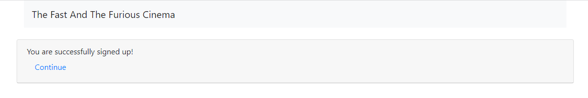

# job4j_cinema

This project is a web application - simple cinema implementation.
User can:
- Sign up, log in, log out and change account
- Choose movies and seats
- View purchased tickets
- View and change personal account data. 
If two or more users try to buy a same ticket on a same session then an error page will be shown.
If there are no available seats, user will be prompted to select another session.

# Used technologies

Implemented with:
<ul>
 <li>JDK 17</li>
 <li>Maven 3.8.5</li>
 <li>Spring Boot 2.5.2</li>
 <li>JDBC 4</li>
 <li>Bootstrap 4.4.1</li>
 <li>Thymeleaf</li>
 <li>PostgreSQL 42.2.16</li>
 <li>Liquibase 3.6.2</li>
</ul>

# Environment requirements

<ul>
 <li>Create db "cinema". Login: postgres, password: password</li>
 <li>Create .jar file via maven command "mvn package"</li>
 <li>Go to the Target folder and check the presence of "job4j_cinema-1.0-SNAPSHOT.jar" file</li>
 <li>Open the command line, go to the Target folder</li>
 <li>Run this file through "java -jar job4j_cinema-1.0-SNAPSHOT.jar" command</li>
 <li>Then go to the http://localhost:8080/index page</li>

# Screenshots
<li> Login page:
   </li>
<li> User adding:
   </li>
<li> Successful user adding:
   </li>
<li> Failed user adding:
   </li>
<li> Failed log in:
   </li>
<li> Index page:
   </li>
<li> Sessions (movies) page:
   </li>
<li> Ticket adding form:
   </li>
<li> Ticket adding form (list):
   </li>
<li> Ordered ticket:
   </li>
<li> User tickets:
   </li>
<li> Seat occupied:
   </li>
<li> All seats sold:
   </li>
<li> Profile page:
   </li>
<li> Profile updating page:
   </li>
</ul>

Contact me: itfedorovsa@gmail.com

